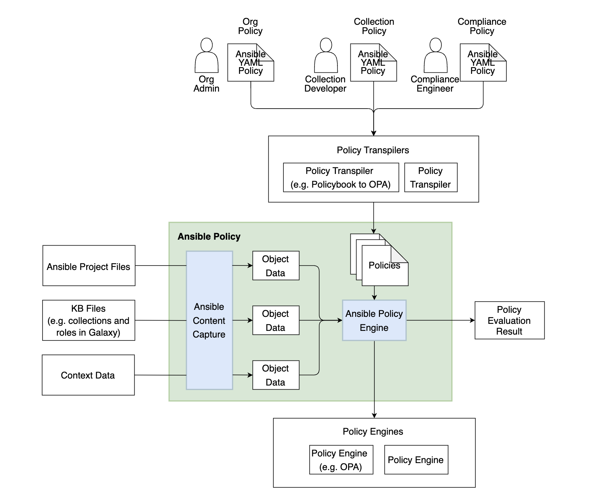

Introduction
====================

Ansible Policy is a prototype implementation which allows 
us to define and set constraints to the Ansible project 
and some other types of data. By default, 
policy evaluation is done by OPA Rego language internally. 
However, you can use other policy engines just by implementing 
some interfaces (See this document :doc:`pluggable_policy_engines`).

The key features of Ansible Policy are

* Ansible project is auto scanned as objects and accessible from policies (using ansible-content-capture scanning internally).
* Multiple policy resolution from the scanned Ansible content.
* Policies can be packed as an ansible collection.
* Users can define policy in YAML format (policybook). It can be auto-transformed with PolicyTranspiler.

