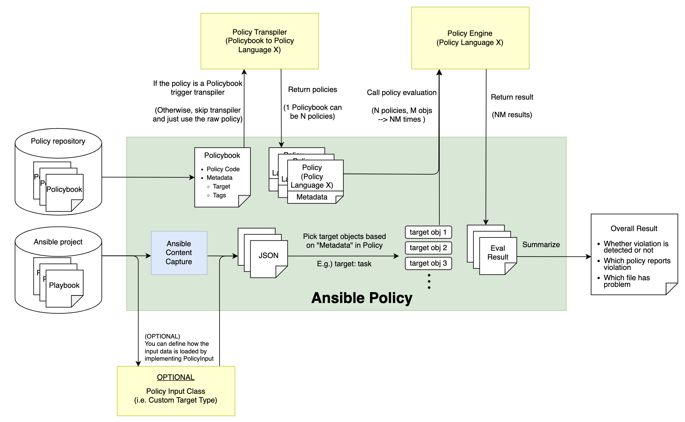

## Pluggable Policy Engines

To enable ansible-policy with your prefered policy engine instead of OPA, you need just the following 3 things.

1. Policy Engine ... A wrapper to invoke policy engine (e.g. exeucte command / http request)
2. Policy Transpiler ... A converter from Policybooks to policy files you want to use
3. (Optional) Policy Input Class ... A custom data loader for your input files

These 3 components are appeared in the architecture below as YELLOW boxes.




### 1. Policy Engine

Policy engine is a just a wrapper implementation of the policy engine you want to use.
For example if your policy engine can be executed as CLI, then "Policy engine" here is just a python implementation to execute the command.

To create this, please follow these steps:
1. Implement a class which inherits the interface `PolicyEngine` [here](../ansible_policy/interfaces/policy_engine.py)
2. Implement `run()` method with the following input/output
- IN: 1 [Policy](../ansible_policy/models.py#L32) object (a loaded policy), 1 [PolicyInput](../ansible_policy/interfaces/policy_input.py#L12) object (a loaded input data)
- OUT: 1 [SingleResult]((../ansible_policy/models.py#L240)) object (policy evaluation result from the engine)
3. Move this python file to your workdir

Reference implementation: [OPA case](../ansible_policy/languages/opa/policy_engine.py)


### 2. Policy Transpiler

Policy transpiler is a code converter from policybooks to policy files for your prefered policy engine.
Please refer to the [Policybook specification](../ansible_policy/policybook/README.md) as well.

To create this, please follow these steps:
1. Implement a class which inherits the interface `PolicyTranspiler` [here](../ansible_policy/interfaces/policy_transpiler.py)
2. Implement `run()` method with the following input/output
- IN: 1 [Policybook](../ansible_policy/policybook/policybook_models.py#L34) object (a loaded policybook)
- OUT: Multiple [Policy](../ansible_policy/models.py#L32) object (1 policybook can be transpiled into multiple policy files)
3. Move this python file to your workdir

Reference implementation: [OPA case](../ansible_policy/languages/opa/policy_transpiler.py)


### 3. (Optional) Policy Input Class

Optionally, you can define how your input data will be loaded as you want.
By default, there are 4 target types `task`, `play`, `event`, `rest` and these are loaded by the pre-defined data loader.
However, you can define a custom target type by implementing PolicyInput class and you can specify your custom type in your policy.

To create this, please follow these steps:
1. Implement a class which inherits the interface `PolicyInputFromJSON` [here](../ansible_policy/interfaces/policy_input.py)
2. Define type name in the attribute `type` of this class and set the default value like the following
   ```
   class YourPolicyInput(PolicyInputFromJSON):
       type: str = "custom_type"
   ```
3. Define other attributes of the class. These attributes can be used in the condition of policies like `input.attribute1`.
4. Move this python file to your workdir

### 4. Prepare a config file

To enable your custom policy engine/transpiler/input, just create a config file like the following.

```ini
[plugins]
default=ansible_policy/languages/opa
custom_type=<PATH/TO/YOUR_WORKDIR>
```